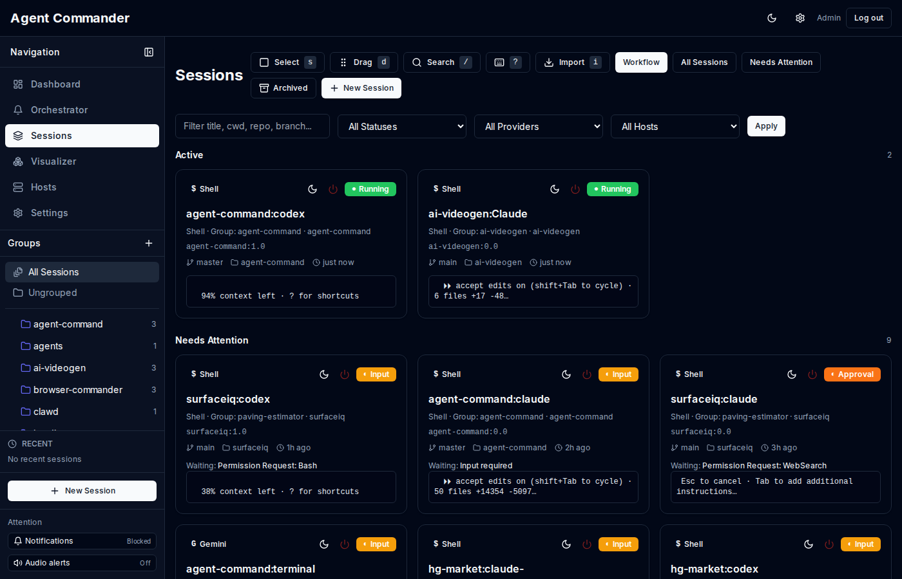
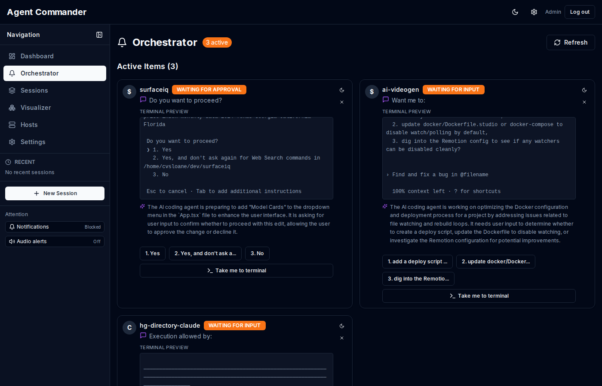
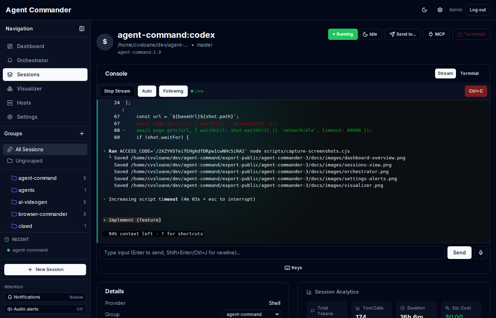
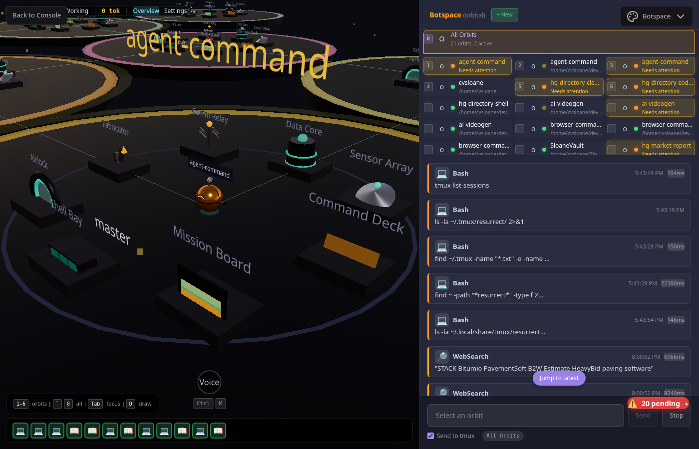
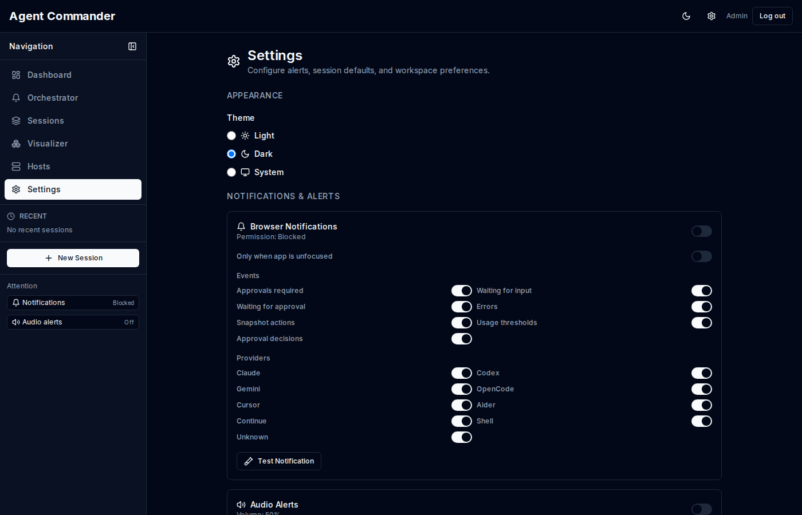
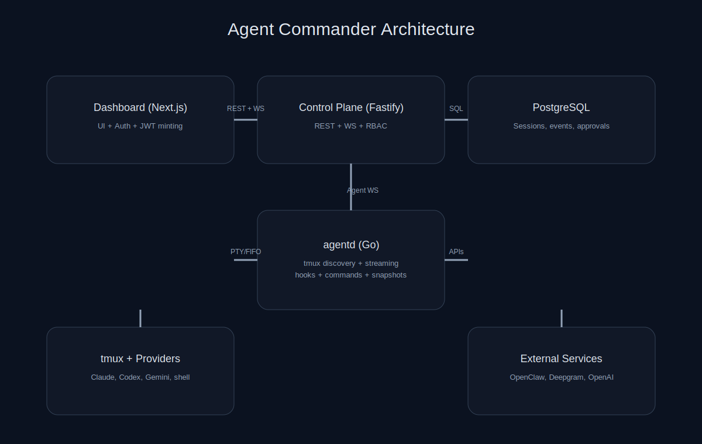

# Agent Commander

[](https://github.com/cvsloane/agent-commander/actions/workflows/ci.yml)
[](LICENSE)
[](https://github.com/cvsloane/agent-commander/releases)
[](https://nodejs.org)
[](https://go.dev)
[](CONTRIBUTING.md)

Agent Commander is a mission-control dashboard for managing AI agent sessions across multiple hosts. It combines a Next.js dashboard, a Fastify control plane, and a Go-based agent daemon (`agentd`).

## Screenshots

<p align="center">
  
</p>

<details>
<summary>More screenshots</summary>

| Sessions | Approvals |
| --- | --- |
|  |  |

| Session Detail | Visualizer |
| --- | --- |
|  |  |



</details>

## Quick Start

```bash
git clone https://github.com/cvsloane/agent-commander.git
cd agent-commander
pnpm install
pnpm dev
```

Copy and update environment files:

```bash
cp services/control-plane/.env.example services/control-plane/.env
cp apps/dashboard/.env.example apps/dashboard/.env
```

Run migrations:
```bash
pnpm db:migrate
```

## Features

- **tmux-native sessions** — discover and manage real tmux panes across hosts
- **Interactive console** — live streaming with full terminal control and read-only viewers
- **Orchestrator + approvals** — attention queue for input, approvals, and errors
- **Session generator** — spawn multi-session templates with groups and links
- **Visualizer** — immersive full-screen activity view
- **Search + analytics** — global search and usage tracking
- **Alerts** — browser, audio, in-app toasts, Clawdbot
- **Multi-host** — one dashboard for many machines

## Documentation

| Guide | Description |
| --- | --- |
| [Docs Index](docs/README.md) | Full documentation map |
| [Overview](docs/overview.md) | Concepts and workflows |
| [Getting Started](docs/getting-started.md) | Install and run locally |
| [Sessions](docs/sessions.md) | Session lifecycle and actions |
| [Console Streaming](docs/console.md) | Interactive tmux in the browser |
| [Orchestrator](docs/orchestrator.md) | Attention queue and summaries |
| [Approvals](docs/approvals.md) | Permission requests and decisions |
| [Coolify Deployment](docs/deployment-coolify.md) | Production setup on Coolify + Cloudflare |
| [API Reference](docs/api.md) | REST + WS endpoints |
| [Security](docs/security.md) | Security best practices |

## Architecture

<p align="center">
  
</p>

## API Reference (Summary)

- `GET /v1/sessions`, `POST /v1/sessions/:id/commands`
- `GET /v1/approvals`, `POST /v1/approvals/:id/decide`
- `GET /v1/hosts`, `POST /v1/hosts`
- `POST /v1/notifications/test`

## Security

- Set strong `JWT_SECRET` and `NEXTAUTH_SECRET`
- Use HTTPS in production
- Store secrets in a secret manager
- Rotate tokens on exposure

See [SECURITY.md](SECURITY.md) for reporting vulnerabilities.

## License

MIT
