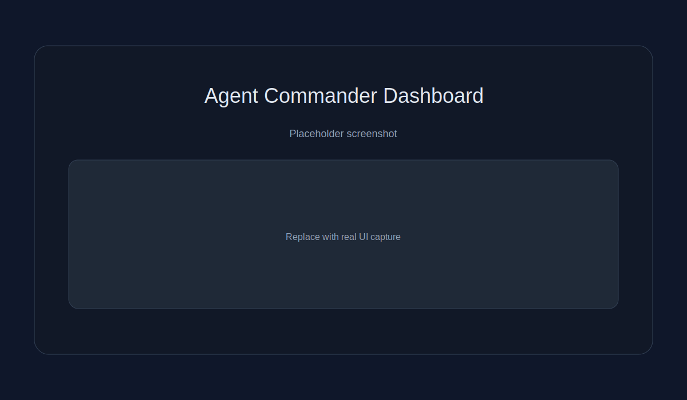
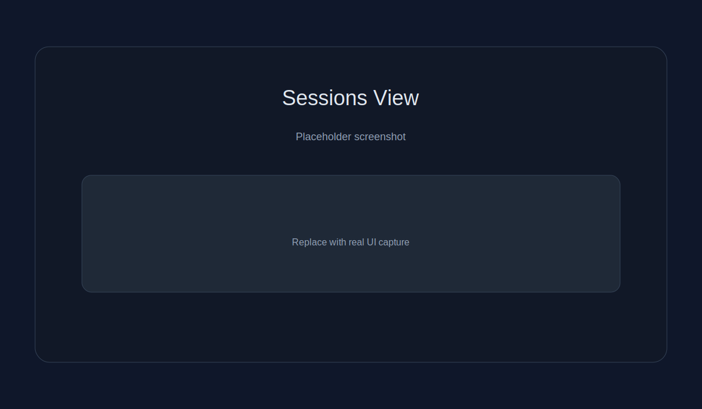
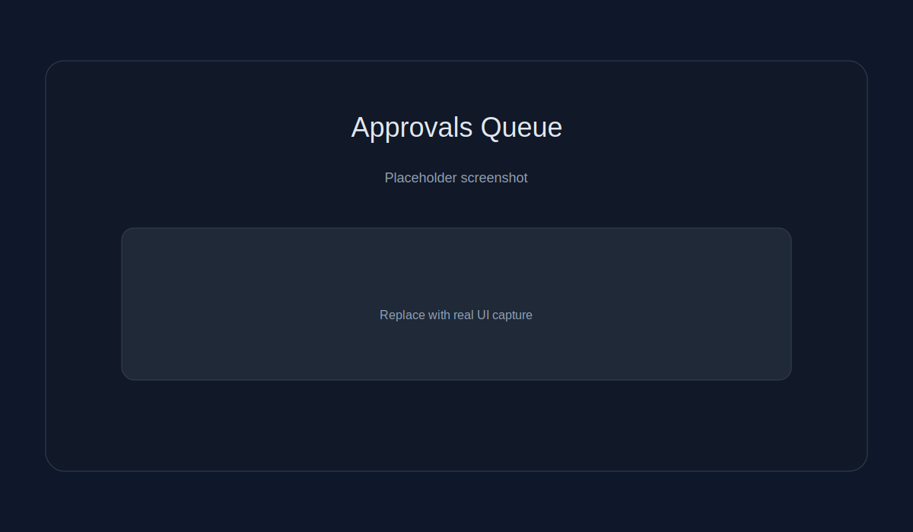

# Agent Commander

[](https://github.com/cvsloane/agent-commander/actions/workflows/ci.yml)
[](LICENSE)
[](https://github.com/cvsloane/agent-commander/releases)
[](https://nodejs.org)
[](https://go.dev)
[](CONTRIBUTING.md)

Agent Commander is a mission-control dashboard for managing AI agent sessions across multiple hosts. It combines a Next.js dashboard, a Fastify control plane, and a Go-based agent daemon (`agentd`).

## Screenshots

<p align="center">
  
</p>

<details>
<summary>More screenshots</summary>

| Sessions | Approvals |
| --- | --- |
|  |  |

</details>

## Quick Start

```bash
git clone https://github.com/cvsloane/agent-commander.git
cd agent-commander
pnpm install
pnpm dev
```

Copy and update environment files:

```bash
cp services/control-plane/.env.example services/control-plane/.env
cp apps/dashboard/.env.example apps/dashboard/.env
```

## Features

- **Session Management** — view and control Claude Code, Codex, Gemini, and shell sessions
- **Approvals Queue** — review and allow/deny permission requests
- **Console Streaming** — live tmux output in the dashboard
- **Real-time Updates** — WebSocket-driven state updates
- **Usage Tracking** — provider utilization + alerts
- **Alerts & Notifications** — browser, audio, in-app toasts, Clawdbot
- **Multi-host Support** — manage sessions across many machines

## Documentation

| Guide | Description |
| --- | --- |
| [Getting Started](docs/getting-started.md) | Install and run locally |
| [Configuration](docs/configuration.md) | Environment variables and config |
| [Deployment](docs/deployment.md) | Docker + production setup |
| [agentd](docs/agentd.md) | Install and run the daemon |
| [Alerts](docs/alerts.md) | Event and provider alerts |
| [Clawdbot](docs/clawdbot.md) | Notification integration |
| [API Summary](docs/api.md) | Key REST endpoints |
| [Security](docs/security.md) | Security best practices |

## Architecture

<p align="center">
  
</p>

## API Reference (Summary)

- `GET /v1/sessions`, `POST /v1/sessions/:id/commands`
- `GET /v1/approvals`, `POST /v1/approvals/:id/decide`
- `GET /v1/hosts`, `POST /v1/hosts`
- `POST /v1/notifications/test`

## Security

- Set strong `JWT_SECRET` and `NEXTAUTH_SECRET`
- Use HTTPS in production
- Store secrets in a secret manager
- Rotate tokens on exposure

See [SECURITY.md](SECURITY.md) for reporting vulnerabilities.

## License

MIT
