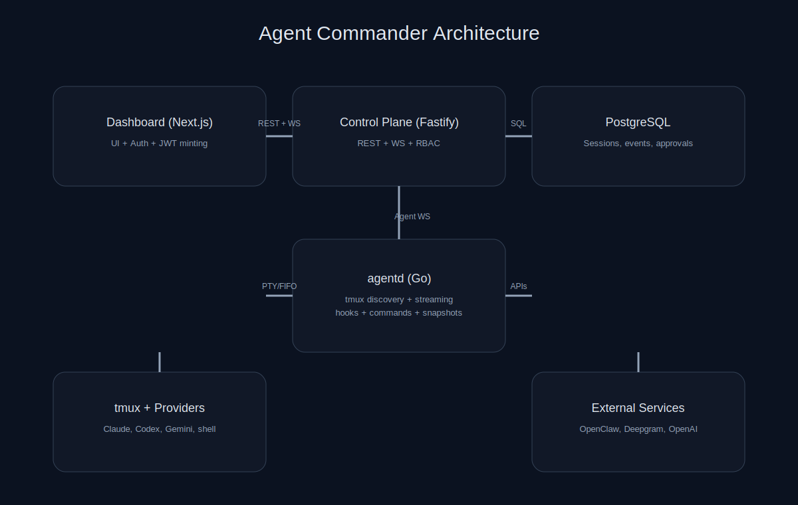

# Architecture

Agent Commander has four primary components:

- Dashboard (Next.js) - the web UI.
- Control plane (Fastify) - REST + WebSocket API, auth, persistence.
- agentd (Go) - host agent that discovers tmux panes and streams output.
- PostgreSQL - session state, events, approvals, analytics, and settings.



```
Browser (Dashboard)
  |  REST + WS
  v
Control Plane  <---->  PostgreSQL
  ^
  |  Agent WS
  v
agentd (tmux + hooks)
```

## Data flows

### UI data stream
1. The dashboard opens a UI WebSocket to `/v1/ui/stream`.
2. It subscribes to topics (sessions, approvals, snapshots, events, usage).
3. The control plane filters and pushes real time updates.

### Terminal streaming (interactive)
1. The dashboard opens `/v1/ui/terminal/:sessionId` WebSocket.
2. The control plane attaches to the target tmux pane via agentd.
3. agentd bridges the pane using a PTY (preferred) or FIFO fallback.
4. Output is pushed to the UI and input is forwarded back to tmux.

### Approvals
1. Provider hooks (Claude/Codex) send permission requests to agentd.
2. agentd emits `approval.requested` to the control plane.
3. The dashboard shows the approval in the queue and orchestrator.
4. The operator decides, and the control plane sends a decision back to agentd.
5. The hook resumes or denies the action.

### Summaries
1. Session snapshots are stored in Postgres.
2. The dashboard can request a summary for an orchestrator item.
3. The control plane calls the summarizer (OpenAI API) and caches results.

## Reliability and ordering

agentd uses a sequence/ack protocol:
- Each outbound message is sequenced.
- The control plane acks in order.
- agentd persists a resend queue and replays on reconnect.

## Deployment topology: single control-plane instance

The control plane is **designed to run as exactly one instance**. This is a
deliberate constraint, not an oversight, and it is load-bearing:

- `services/pubsub.ts` holds UI clients and agent connections in in-process
  `Map`s. Fan-out only reaches sockets attached to the local process.
- `security/webSocketAuth.ts` keeps one-time WebSocket tickets in memory. A
  ticket minted by one replica cannot be redeemed by another.
- `index.ts` caches user identity per process to avoid an upsert per request.

Consequences to plan around:

- **Do not scale the control plane horizontally.** A second replica silently
  breaks WebSocket fan-out and ticket redemption. Scale vertically instead.
- Every deploy drops live WebSocket connections; clients reconnect and replay
  via the sequence/ack protocol above, so this is disruptive but not lossy.
- Agent and browser reconnect storms after a restart are expected behaviour.

Moving to multiple replicas means externalising all three: Redis (or Postgres
`LISTEN/NOTIFY`) for pubsub, a shared store for tickets, and dropping the user
cache. That work is tracked in `BACKLOG.md`; until it is done, treat the single
instance as an architectural invariant.

## Security boundaries

- Dashboard users authenticate via NextAuth (GitHub or access code).
- The dashboard mints short lived JWTs for control plane REST/WS calls.
- agentd connects with a host-scoped token.
- Role based access control (admin/operator/viewer) gates write actions.
