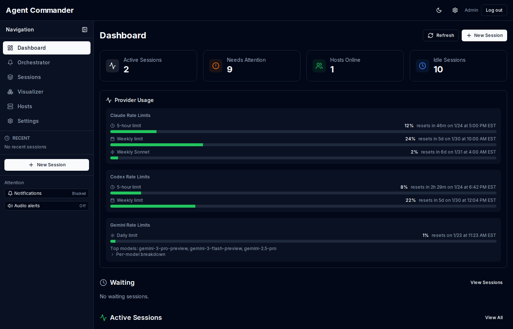

# Overview

Agent Commander is a tmux-native control plane for running AI work across one or many machines. It discovers real tmux panes, streams them live into the browser, adds repo and global memory to every session, and layers autonomous orchestration on top without replacing the normal session runtime.

## Command Center

- `/` is the primary working surface for fleet status, live panes, windows, and terminal intervention.
- `/tmux` remains a compatibility redirect to the Command Center.
- The workspace supports window and pane management, persistent and two-up terminals, terminal history, prompt composition, and in-context attention handling.
- Launch, add-host enrollment, and the command palette shorten common operator paths.
- `/automation` adds orchestrators, workers, wakeups, governance approvals, and work queues.
- `/memory` adds repo-scoped and global memory with procedural, semantic, episodic, and working tiers.
- Hermes can now wake orchestrators externally and consume deterministic watchdog/governance summaries.

## What makes Agent Commander different

- It is tmux native. Sessions are real panes on real machines, not synthetic web terminals.
- It is session native. Autonomous runs still use normal sessions, so streaming, snapshots, and intervention keep working.
- Multi-host is first class. One dashboard can control many machines and route work to the right host.
- Approvals and governance are built in. Human intervention paths exist for both live sessions and autonomous decisions.
- Memory is additive, not magical. Repo and global knowledge improve sessions without hiding the underlying terminal workflow.

## Source inspiration

Recent architecture work intentionally borrowed ideas, not codebases:

- **Paperclip-inspired orchestration**: wake queues, transactional run claiming, budget gates, governance approvals, worker/orchestrator hierarchy, and runtime reuse.
- **Ruflo-inspired memory**: scoped memory, procedural knowledge, trajectory capture, and conservative promotion of repeated successful patterns.

Agent Commander keeps its own core advantage: `agentd` and the session model remain the execution substrate, so autonomous work still lands in the same live terminals operators already use.

## Core concepts

- Host: a machine running `agentd`.
- Session: a tmux pane or job with a stable ID and metadata.
- Command Center: the `/` surface that combines fleet state, the host roster, tmux windows and panes, and live terminal work.
- Automation agent: an orchestrator or worker definition with wake, budget, memory, and concurrency policy.
- Memory entry: a scoped knowledge object (`working`, `episodic`, `semantic`, or `procedural`) stored at repo or global scope.
- Work item: a queued unit of autonomous work that can be claimed by a worker.
- Governance approval: an automation-level decision that requires human input before a blocked run can continue.
- Snapshot: a rolling capture of terminal output for quick scanning.
- Event: a persisted timeline entry for session or automation lifecycle changes.

## Typical workflows

### Command Center daily workflow

1. Install `agentd` on a host and connect it to the control plane.
2. Open `/` and choose a host from the fleet roster.
3. Pick a live tmux window or pane and work from the inline terminal surface.
4. Split or open a second terminal when comparing panes, and use the attention overlay when the session needs intervention.
5. Use `/sessions` and `/orchestrator` when you need the broader operator view.

### Memory-backed workflow

1. Start a session manually or let automation create one.
2. Agent Commander injects repo and global memory into the session bootstrap context.
3. Finished sessions distill into episodic memory and trajectories.
4. Repeated successful patterns can later become procedural memory for future runs.

### Autonomous workflow

1. Create orchestrators and workers in `/automation`.
2. Queue manual wakes or configure schedules and external wake sources.
3. Review governance approvals for budget, host, or scope issues.
4. Inspect runs, worker reports, and linked live sessions when intervention is needed.

## Feature map

- Command Center for fleet, windows, panes, and live terminals
- Window creation, rename, close, and pane split, select, zoom, and termination
- Persistent single-terminal and desktop two-up terminal layouts
- Unified launch rail/mobile sheet, add-host enrollment, and command palette
- Spawn, rename, kill, fork, idle, wake, and inspect sessions
- Live console streaming with read-only and control modes
- Orchestrator attention queue for waiting input, approvals, and errors
- Autonomous orchestrators and workers with concurrency policy and runtime reuse
- Repo and global memory search, authoring, and distillation
- Hermes-friendly integration endpoints and summaries
- Approval decisions with hooks and keystroke fallback
- Provider usage analytics and thresholds
- Alerts via browser, audio, in-app toasts, and OpenClaw
- Voice transcription and MCP enablement
