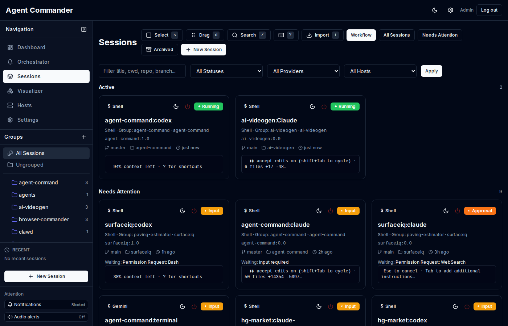

# Sessions

Sessions are the core execution unit in Agent Commander. A session usually maps to a tmux pane, but can also represent jobs or services. Even autonomous runs stay session-native, so live streaming, snapshots, approvals, and intervention all work the same way.

## Where to work

- `/tmux` is the primary day-to-day surface for live tmux panes and windows.
- `/sessions` remains the broader operator view across tmux panes, jobs, and services.
- `/sessions/[id]` is the detailed per-session control surface.

## Session types

- `tmux_pane` - a live tmux pane.
- `job` - a provider job (e.g., codex exec).
- `service` - a long running background task.

## Session providers

Supported providers include:
- claude_code
- codex
- gemini_cli
- opencode
- cursor
- aider
- continue
- shell
- unknown

## Status lifecycle

Common statuses:
- STARTING
- RUNNING
- IDLE
- WAITING_FOR_INPUT
- WAITING_FOR_APPROVAL
- ERROR
- DONE

The orchestrator uses WAITING_FOR_INPUT, WAITING_FOR_APPROVAL, and ERROR to build the attention queue.

## Discovery and tmux management

`agentd` polls tmux and registers panes automatically. The tmux manager groups live panes by host, tmux session name, and window so you can open work directly without treating tmux discovery as a separate import workflow.

Older orphan/adopt flows still exist on advanced surfaces for edge cases, but the primary `/tmux` workflow shows unmanaged panes automatically when they are already in the session registry.

## Grouping

Groups are folders for sessions. The control plane can auto group by tmux session name when the tmux metadata includes `session_name`.

- Create groups manually from the UI or API.
- Drag and drop sessions into groups.
- Groups can be nested.

## Links

Sessions can be linked to indicate relationships:
- `complement` - two sessions are part of the same workstream.
- `review` - one session reviews another.

Links show up on the session detail page and help with cross session navigation.

## Snapshots and events

- agentd captures snapshots of pane output at intervals.
- Snapshots enable fast preview and summarize context.
- Events persist command dispatches, approvals, errors, and tool events.

## Session actions

From the dashboard or API you can:
- Rename sessions.
- Kill sessions.
- Spawn new sessions from templates.
- Fork a session into a new tmux window.
- Copy pane output into another session.
- Archive or unarchive sessions.
- Mark a session as idle or wake it.
- Open the inline tmux workbench from `/tmux` for terminal control without leaving the roster view.
