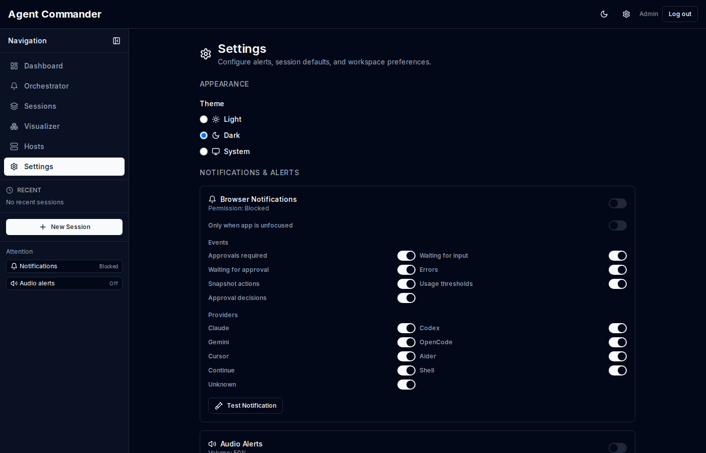

# Settings

Settings are stored per user and synced to the control plane. The settings panel groups options into several sections.

## Appearance

- Light, dark, or system theme.

## Notifications and alerts

- Enable browser notifications, audio alerts, and in app toasts.
- Configure OpenClaw push notifications.
- Set per event and per provider filters.
- Customize usage threshold alerts.

## Provider usage

- Choose which providers appear in the usage summary card.

## Mobile terminal

- Set the terminal font between 11–18 px; pinching the terminal updates the same
  setting, and Reset returns it to 14 px.
- Choose the Minimal or Expanded terminal rail, or apply versioned JSON with
  keysyms, chords, macros, and swipe-up popup bindings.
- Set a tmux prefix per host using notation such as `C-b`, `C-a`, or `M-a`.

The mobile terminal uses this single rail in the keyboard inset. Older virtual
keyboard key-order settings remain for standalone legacy terminal surfaces;
they do not add a second strip to the Command Center terminal.

## Visualizer

- Show or hide the visualizer in the sidebar.
- Choose a default visualizer theme.

## Repo picker

- Add dev folders per host for faster repo selection.
- Choose sorting rules and hidden folder visibility.

## Session generator

- Default provider and naming pattern.
- Default template for multi session spawn.
- Auto link sessions and auto create groups.

## Host access

- Manage directory listing permissions for each host.
